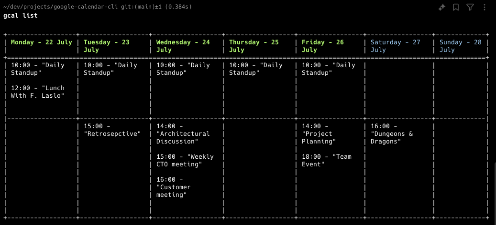

# Google Calendar CLI - gcal


This project is a command-line interface (CLI) tool written in Rust for managing your Google Calendar. The primary purpose is to allow users to interact with their Google Calendar directly from the terminal. Adding a new event or listing them should be very easy and quick.

*Note: This project is in a very early phase, and many features are still missing. It is currently a playground project, meant for exploration and experimentation.*



Happy scheduling!

***

## Installation


```
git clone git@github.com:zeldan/google-calendar-cli.git
cd google-calendar-cli
cargo build && cargo install --path . --locked
```

## Usage


### Help

```
gcal help
```

### Add event


Quick event for today

```
gcal "Retro & Demo at 16:00"
```

Quick event on a specific date

```
gcal "Appointment on June 3rd 10am-10:25am"
```

Add event with specifying the date.


```
gcal "Appointment" "10:25"
```
```
gcal "Appointment" "07-13 23:25"
```
```
gcal add "Appointment" "2024-07-12 10:25"
```

Add event with conference meeting
```
gcal "Appointment" "23:45" --conference
```

List events

```
gcal list
```


## Authentication

By default, a hardcoded and unverified Google secret is included in the project. This secret has a user cap limit and can be used temporarily. If you want to use your custom authentication (via Google Console), you can find step-by-step instructions [here](docs/custom_auth.md).

How it works in the background ?

1. Start gcalcli. The authentication process will begin automatically.
2. Follow the instructions to complete the authentication process.

The resulting token will be stored in the `~/.gcal/store.json` file.


## Development

For example, you can list the events using the following command:

```
cargo run -- list
```